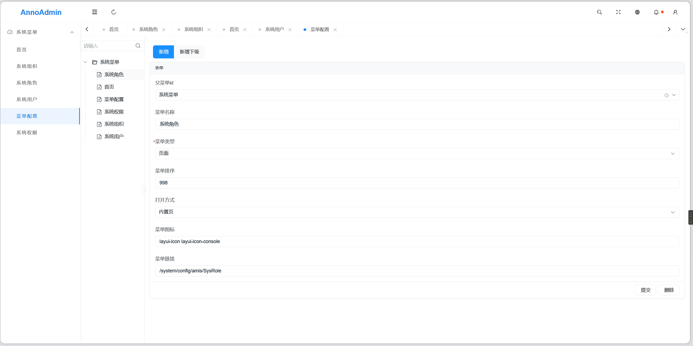
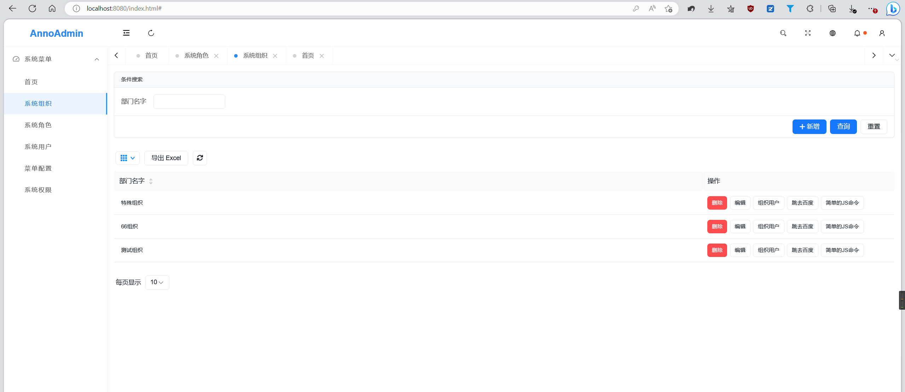
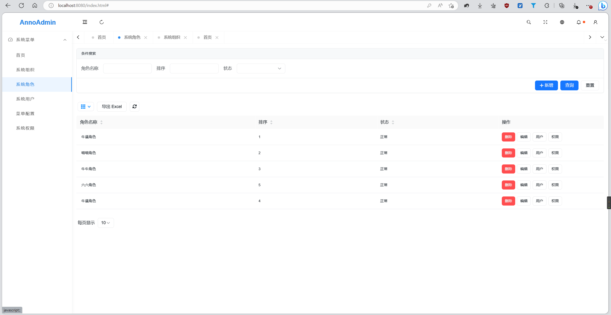
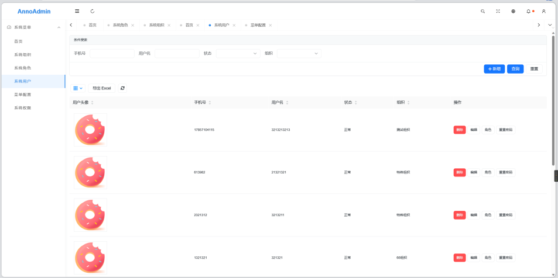

# Anno-Admin
## [文档地址](https://www.yuque.com/sorghums/anno-admin)
[](https://gitee.com/cmeet/anno-admin)

### 交流群


Anno-Admin是一个后端基于Solon框架,前端Hooks Admin项目,前端渲染采用百度AMIS的开源项目，旨在通过注解生成后台管理系统。Solon框架是一个轻量级的Java Web框架，具有高性能、低内存占用、易于扩展等特点。Anno-Admin利用Solon框架的优势，通过注解的方式自动生成后台管理系统的各种功能，大大减少了开发者的工作量。使用Anno-Admin，开发者只需要关注业务逻辑的实现，无需手动编写大量的重复代码，从而提高了开发效率。同时，Anno-Admin也为想要学习注解和代码生成技术的开发者提供了一个很好的学习平台。总之，Anno-Admin是一个非常实用、易用、高效的后台管理系统开发工具，值得开发者们去尝试和使用。
## 特点
通过注解生成后台管理系统
支持用户管理、权限管理、数据管理等功能
简化后台管理系统的开发流程
适合快速开发后台管理系统的开发者
适合想要学习注解和代码生成技术的开发者
## 使用方法
在项目中添加Anno-Admin的依赖
在代码中添加注解，指定需要生成的后台管理系统功能
## 演示
系统菜单：


系统菜单代码：

```java
package site.sorghum.anno.modular.menu.entity.ao;

import com.alibaba.fastjson2.annotation.JSONField;
import lombok.Data;
import lombok.EqualsAndHashCode;
import org.noear.wood.annotation.Table;
import site.sorghum.anno.modular.anno.annotation.clazz.AnnoMain;
import site.sorghum.anno.modular.anno.annotation.clazz.AnnoPermission;
import site.sorghum.anno.modular.anno.annotation.clazz.AnnoTree;
import site.sorghum.anno.modular.anno.annotation.field.AnnoEdit;
import site.sorghum.anno.modular.anno.annotation.field.AnnoField;
import site.sorghum.anno.modular.anno.annotation.field.AnnoSearch;
import site.sorghum.anno.modular.anno.annotation.field.type.AnnoOptionType;
import site.sorghum.anno.modular.anno.enums.AnnoDataType;
import site.sorghum.anno.modular.preinstall.model.BaseMetaModel;


/**
 * 系统菜单
 *
 * @author Sorghum
 * @since 2023/05/19
 */
@Data
@EqualsAndHashCode(callSuper = true)
@AnnoMain(name = "菜单管理",
        annoTree = @AnnoTree(label = "title", parentKey = "parentId", key = "id", displayAsTree = true),
        annoPermission = @AnnoPermission(enable = true, baseCode = "sys_anno_menu", baseCodeTranslate = "菜单管理"))
@Table("sys_anno_menu")
public class SysAnnoMenu extends BaseMetaModel {

    @JSONField(name = "parentId")
    @AnnoField(title = "父菜单", tableFieldName = "parent_id", edit = @AnnoEdit)
    private String parentId;

    @AnnoField(title = "菜单名称", tableFieldName = "title", edit = @AnnoEdit)
    @JSONField(name = "title")
    private String title;

    @AnnoField(title = "菜单类型", tableFieldName = "type", search = @AnnoSearch(),
            dataType = AnnoDataType.OPTIONS,
            optionType = @AnnoOptionType(value = {
                    @AnnoOptionType.OptionData(label = "页面", value = "1"),
                    @AnnoOptionType.OptionData(label = "目录", value = "0")
            }),
            edit = @AnnoEdit(placeHolder = "请选择菜单类型", notNull = true))
    @JSONField(name = "type")
    private Integer type;

    @AnnoField(title = "菜单排序", tableFieldName = "sort", edit = @AnnoEdit)
    @JSONField(name = "sort")
    private Integer sort;

    @AnnoField(title = "打开方式", tableFieldName = "open_type", edit = @AnnoEdit, optionType = @AnnoOptionType(value = {
            @AnnoOptionType.OptionData(label = "内置页", value = "_iframe"),
    }), dataType = AnnoDataType.OPTIONS)
    @JSONField(name = "openType")
    private String openType;

    @AnnoField(title = "菜单图标", tableFieldName = "icon", edit = @AnnoEdit)
    @JSONField(name = "icon")
    private String icon;

    @AnnoField(title = "菜单链接", tableFieldName = "href", edit = @AnnoEdit)
    @JSONField(name = "href")
    private String href;

    @AnnoField(title = "权限标识", tableFieldName = "permission_id", edit = @AnnoEdit,
            dataType = AnnoDataType.OPTIONS,
            optionType = @AnnoOptionType(sql = "select id as value, name as label from sys_permission where del_flag = 0 and parent_id is null order by id desc"))
    @JSONField(name = "permissionId")
    private String permissionId;
}

```
系统组织：


系统组织代码：

```java
package site.sorghum.anno.modular.preplugin.ao;


import lombok.Data;
import lombok.EqualsAndHashCode;
import org.noear.wood.annotation.Table;
import site.sorghum.anno.modular.anno.annotation.clazz.AnnoMain;
import site.sorghum.anno.modular.anno.annotation.clazz.AnnoPermission;
import site.sorghum.anno.modular.anno.annotation.field.AnnoButton;
import site.sorghum.anno.modular.anno.annotation.field.AnnoEdit;
import site.sorghum.anno.modular.anno.annotation.field.AnnoField;
import site.sorghum.anno.modular.anno.annotation.field.AnnoSearch;
import site.sorghum.anno.modular.preinstall.model.BaseMetaModel;

/**
 * 系统组织
 *
 * @author sorghum
 * @since 2023/05/27
 */
@Data
@EqualsAndHashCode(callSuper = true)
@AnnoMain(name = "组织管理",
        annoPermission = @AnnoPermission(enable = true, baseCode = "sys_org", baseCodeTranslate = "组织管理"))
@Table("sys_org")
public class SysOrg extends BaseMetaModel {

    /**
     * 部门名字
     */
    @AnnoField(title = "部门名字", tableFieldName = "org_name",
            search = @AnnoSearch(),
            edit = @AnnoEdit(editEnable = true, addEnable = true, placeHolder = "请输入部门名字"))
    private String orgName;


    @AnnoButton(name = "组织用户",
            o2mJoinButton = @AnnoButton.O2MJoinButton(joinAnnoMainClazz = SysUser.class, joinThisClazzField = "id", joinOtherClazzField = "orgId", enable = true))
    private Object userButton;

    @AnnoButton(name = "跳去百度", jumpUrl = "https://www.baidu.com/?tn=${clazz}&props=${props}")
    private Object jump2BaiduButton;

    @AnnoButton(name = "简单的JS命令", jsCmd = "alert('点击了按钮'); console.log(props);")
    private Object jsCmd;
}
```
系统角色：


系统角色代码：

```java
package site.sorghum.anno.modular.preplugin.ao;

import lombok.Data;
import lombok.EqualsAndHashCode;
import org.noear.wood.annotation.Table;
import site.sorghum.anno.modular.anno.annotation.clazz.AnnoMain;
import site.sorghum.anno.modular.anno.annotation.clazz.AnnoPermission;
import site.sorghum.anno.modular.anno.annotation.field.AnnoButton;
import site.sorghum.anno.modular.anno.annotation.field.AnnoEdit;
import site.sorghum.anno.modular.anno.annotation.field.AnnoField;
import site.sorghum.anno.modular.anno.annotation.field.AnnoSearch;
import site.sorghum.anno.modular.anno.annotation.field.type.AnnoOptionType;
import site.sorghum.anno.modular.anno.enums.AnnoDataType;
import site.sorghum.anno.modular.preinstall.model.BaseMetaModel;

import java.io.Serializable;

@Data
@EqualsAndHashCode(callSuper = true)
@AnnoMain(name = "角色管理",
        annoPermission = @AnnoPermission(enable = true, baseCode = "sys_role", baseCodeTranslate = "角色管理"))
@Table("sys_role")
public class SysRole extends BaseMetaModel implements Serializable {

    /**
     * 角色名称
     */
    @AnnoField(title = "角色名称", tableFieldName = "role_name", search = @AnnoSearch(),
            edit = @AnnoEdit(placeHolder = "请输入角色名称", notNull = true))
    String roleName;

    /**
     * 排序
     */
    @AnnoField(title = "排序", tableFieldName = "sort", search = @AnnoSearch(),
            edit = @AnnoEdit(placeHolder = "请输入排序", notNull = true))
    Integer sort;

    /**
     * 状态 1 正常 0 封禁
     */
    @AnnoField(title = "状态", tableFieldName = "enable", search = @AnnoSearch(),
            dataType = AnnoDataType.OPTIONS,
            optionType = @AnnoOptionType(value = {
                    @AnnoOptionType.OptionData(label = "正常", value = "1"),
                    @AnnoOptionType.OptionData(label = "封禁", value = "0")
            }),
            edit = @AnnoEdit(placeHolder = "请选择状态", notNull = true))
    Integer enable;

    /**
     * 角色按钮
     */
    @AnnoButton(name = "用户", m2mJoinButton = @AnnoButton.M2MJoinButton(
            joinAnnoMainClazz = SysUser.class,
            mediumTable = "sys_user_role",
            mediumTableClass = SysUserRole.class,
            mediumOtherField = "role_id",
            mediumThisFiled = "user_id",
            joinThisClazzField = "id"
    ))
    private Object userButton;


    /**
     * 角色按钮
     */
    @AnnoButton(name = "权限", m2mJoinButton = @AnnoButton.M2MJoinButton(
            joinAnnoMainClazz = SysPermission.class,
            mediumTableClass = SysRolePermission.class,
            mediumOtherField = "role_id",
            mediumThisFiled = "permission_id",
            joinThisClazzField = "id"
    ))
    private Object roleButton;
}

```
系统用户：


系统用户代码：

```java
package site.sorghum.anno.modular.preplugin.ao;

import lombok.Data;
import lombok.EqualsAndHashCode;
import org.noear.wood.annotation.PrimaryKey;
import org.noear.wood.annotation.Table;
import site.sorghum.anno.modular.anno.annotation.clazz.AnnoMain;
import site.sorghum.anno.modular.anno.annotation.clazz.AnnoPermission;
import site.sorghum.anno.modular.anno.annotation.clazz.AnnoProxy;
import site.sorghum.anno.modular.anno.annotation.field.AnnoButton;
import site.sorghum.anno.modular.anno.annotation.field.AnnoEdit;
import site.sorghum.anno.modular.anno.annotation.field.AnnoField;
import site.sorghum.anno.modular.anno.annotation.field.AnnoSearch;
import site.sorghum.anno.modular.anno.annotation.field.type.AnnoImageType;
import site.sorghum.anno.modular.anno.annotation.field.type.AnnoOptionType;
import site.sorghum.anno.modular.anno.enums.AnnoDataType;
import site.sorghum.anno.modular.auth.service.AuthService;
import site.sorghum.anno.modular.preinstall.model.BaseOrgMetaModel;
import proxy.site.sorghum.anno.pre.plugin.SysUserProxy;

import java.io.Serializable;

@Data
@EqualsAndHashCode(callSuper = true)
@AnnoMain(name = "用户管理",
        annoPermission = @AnnoPermission(enable = true, baseCode = "sys_user", baseCodeTranslate = "用户管理"),
        annoProxy = @AnnoProxy(value = SysUserProxy.class))
@Table("sys_user")
public class SysUser extends BaseOrgMetaModel implements Serializable {

    /**
     * 用户头像
     */
    @AnnoField(title = "用户头像",
            tableFieldName = "avatar",
            dataType = AnnoDataType.IMAGE,
            edit = @AnnoEdit(placeHolder = "请上传用户头像"),
            imageType = @AnnoImageType(thumbMode = AnnoImageType.ThumbMode.COVER, thumbRatio = AnnoImageType.ThumbRatio.RATE_ONE))
    private String avatar;
    /**
     * 手机号
     */
    @AnnoField(title = "手机号", tableFieldName = "mobile", search = @AnnoSearch(),
            edit = @AnnoEdit(placeHolder = "请输入手机号", notNull = true))
    private String mobile;
    /**
     * 密码
     */
    @AnnoField(title = "密码", tableFieldName = "password",
            edit = @AnnoEdit(placeHolder = "请输入密码", notNull = true, editEnable = false), show = false)
    private String password;
    /**
     * 用户名
     */
    @AnnoField(title = "用户名", tableFieldName = "name", search = @AnnoSearch(),
            edit = @AnnoEdit(placeHolder = "请输入用户名", notNull = true))
    private String name;

    /**
     * 状态 1 正常 0 封禁
     */
    @AnnoField(title = "状态", tableFieldName = "enable", search = @AnnoSearch(),
            dataType = AnnoDataType.OPTIONS,
            optionType = @AnnoOptionType(value = {
                    @AnnoOptionType.OptionData(label = "正常", value = "1"),
                    @AnnoOptionType.OptionData(label = "封禁", value = "0")
            }),
            edit = @AnnoEdit(placeHolder = "请选择状态", notNull = true))
    private Integer enable;

    /**
     * 角色按钮
     */
    @AnnoButton(name = "角色", m2mJoinButton = @AnnoButton.M2MJoinButton(
            joinAnnoMainClazz = SysRole.class,
            mediumTable = "sys_user_role",
            mediumTableClass = SysUserRole.class,
            mediumOtherField = "user_id",
            mediumThisFiled = "role_id",
            joinThisClazzField = "id"
    ))
    private Object roleButton;

    /**
     * 重置密码按钮
     */
    @AnnoButton(name = "重置密码", javaCmd = @AnnoButton.JavaCmd(beanClass = AuthService.class, methodName = "resetPwd"))
    private Object resetPwdButton;

}
```
## 初步文档
### 全局注解：
@AnnoScan
启动类上增加
### 类注解：
#### 主要类：
@AnnoMain

- name：类名称
- annoProxy：前置代理类
    - @AnnoProxy
        - value**: **代理类,Class<? extends AnnoBaseProxy>
- annoPermission：权限启用类
    - @AnnoPermission
        - baseCode：基础权限名称(即查看权限) 如：sys_org
        - baseCodeTranslate：基础权限翻译，入：系统组织
        - enable： 是否启用，默认false
- annoLeftTree：左树右表配置
    - @AnnoLeftTree
        - catKey：分类关键词，当前类的树列的名称
        - treeClass：左边的树类
        - enable：是否启用，默认为true
- annoTree：当前类树的配置
    - @AnnoTree
        - label: 标签 树展示字段，一般为name
        - parentKey：父节点的的关键词，一般为：pid
        - key： 当前节点关键词，一般为id
        - displayAsTree：是否展示为树
        - enable：是否启用

@Table
- value: 声明表名
#### 删除配置类：
@AnnoRemove

- removeType：删除类型 0 物理删除 1 逻辑删除
- removeValue：逻辑删除值 默认 1
- notRemoveValue：逻辑删除值 默认 0
- removeField：逻辑删除字段 默认 del_flag
#### 前置代理类：
@AnnoPreProxy

- value：代理类，Class<? extends AnnoPreBaseProxy> value()
### 列注解
主要类：
@AnnoField

- title：标题
- tableFieldName：表字段名
- show：显示
- search：搜索信息
    - @AnnoSearch
        - notNull：是否必填
        - placeHolder：提示信息
        - enable：是否启用，默认启用
- edit： 编辑信息
    - @AnnoEdit
        - notNull：是否必填
        - placeHolder：提示信息
        - addEnable：启用新增
        - editEnable：编辑启用
- dataType：数据类型
    - **_STRING _**字符串
    - **_FILE _**文件
    - **_IMAGE  _**图片
    - **_NUMBER  _**数字
    - **_DATE _**日期
    - **_DATETIME  _**日期时间
    - **_OPTIONS _**下拉框
    - **_RICH_TEXT _**富文本
    - **_EDITOR  _**编辑器
- optionType：如果是options，则需要完成：选择类型
    - @AnnoOptionType
        - sql：比如 select value, label from table where del_flag = 0 order by id desc
        - value：@OptionData[]
- imageType：如果是iamge，则需要完成：图像类型
    - @AnnoImageType
        - thumbRatio：预览图比率.
        - thumbMode：图片模式
        - enlargeAble：点击可放大展示
        - width：宽度 px
        - height：高度 px

@PrimaryKey
- value：主键名称

#### 按钮注解
> 自定义逻辑 一对多 多对多的连表逻辑

@AnnoButton

- name：按钮名称
- size：按钮大小 'xs' | 'sm' | 'md' | 'lg'
- ----以下为按钮事件----
- jsCmd： 按下按钮后的js命令
- jumpUrl：跳转的url
- o2mJoinButton：一对多关联按钮
- m2mJoinButton：多对多关联按钮
- javaCmd：java命令

## 自动生成表结构
项目启动后，会对`@AnnoMain`注解标记的实体类，做以下处理：

1. 如果实体类对应的表不存在，自动创建表；
2. 如果表存在，且实体类上有新增字段，会将新增字段添加到已有的表上；
3. 对于实体类上已经删除的字段，不会将已有的字段删除，需要手动处理；
4. 如果实体类上的字段信息（类型，长度，备注等）和数据库中不一致，不会做任何处理，需要手动处理；

如果想要关闭改功能，可以添加配置：
```yaml
anno-admin:
  isAutoMaintainTable: false
```

## 预置数据

项目启动后，会扫描 `resources/init-data/*.sql` 的所有文件，将依次执行文件中的 sql。

对于 insert 语句：

- 如果当前行的数据不存在，则执行 insert 语句；
- 按照主键（`id`）查询数据库已有的数据，将每个字段，和当前的`insert`语句中的值进行比较，如果不一致，则生成 `update` 语句；
- 预置数据升级时，会忽略系统字段（`create_time`、`create_by`、`update_time`、`update_by`、`del_flag`）的比较；

如果想要关闭改功能，可以添加配置：
```yaml
anno-admin:
  isAutoMaintainInitData: false
```

## 贡献
如果您发现了任何问题或有任何建议，请随时提交issue或pull request。我们非常欢迎您的贡献！

## 许可证
Anno-Admin使用Apache 2.0许可证。详情请参阅LICENSE文件。